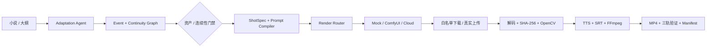

# MangaFlow Studio

连续性驱动的 AI 漫剧生产工作台。仓库包含一个 Next.js 高保真创作界面，以及一条可测试的 FastAPI 垂直链路：文本改编、结构化分镜、连续性门禁、生成路由、Provider 任务、媒体硬质检和恢复检查点。

> 当前状态：工程化 MVP。默认使用确定性结构化改编模型与 Mock 媒体 Provider；未配置真实媒体服务时，前端会明确显示 `DEMO DATA / MOCK RESULT`，不会把模拟分数当作实测结果。

项目已按业务级方案重新排序，完整能力矩阵、Sprint 验收目标与“不承诺项”见 [docs/ROADMAP.md](docs/ROADMAP.md)。当前优先级是打通可验证的真实短片垂直链路，而不是继续增加演示页数量。

## 当前真实能力

| 模块 | 当前实现 | 明确边界 |
| --- | --- | --- |
| 文档入口 | TXT、Markdown、DOCX、结构化剧本 JSON 安全解析，长文本重叠切分与内容哈希 | 尚未接入对象存储与在线文档协作 |
| 文本改编 | 输入驱动的 `AdaptationAgent`，输出角色、场景、事件、8 个 `ShotSpec` 和节点 Trace | 默认离线确定性模型，不宣称是云端 LLM 推理 |
| 租户与协作 | Organization/Membership/RBAC、评论、审批和不可变审计记录；所有项目查询绑定组织；严格模式校验网关 HMAC 身份签名 | 默认本地开发身份；正式生产仍应接入 IdP/JWT 与密钥管理 |
| 资产版本 | 来源/许可/Prompt/父版本可追溯；依赖图将上游变更传播为下游 stale | 当前使用模块化单体内的依赖图，不是图数据库 |
| 连续性图谱 | 相邻状态、`must_preserve`、场景地点、服装归属、前序顺序、缺失依赖和依赖环检测 | 尚未使用图数据库 |
| Prompt 编译 | 编入项目风格、角色 AppearanceVersion、场景圣经、镜头动作和稳定语义哈希 | 不运行提示词自动优化模型 |
| 生成路由 | 2.5D、肖像驱动、I2V、Premium I2V、T2V 规则路由和成本解释 | 规则策略，不包装成学习型 Router |
| Provider | 图片、I2V、TTS 独立绑定；支持 ComfyUI 与云端任务 API、健康检查、报价、错误归一化、幂等恢复和产物收敛 | CI 的合同测试不代表真实供应商 SLA；真实凭据尚未配置 |
| 工作流 | 原子 JSON Checkpoint、乐观锁、预算封顶、暂停/恢复/取消；任务拥有 CREATED 到 UNKNOWN 的显式时间线与对账接口 | 尚未接入 Temporal/PostgreSQL |
| 媒体质检 | OpenCV 真实解码，检测 FPS、时长、分辨率、黑帧、闪烁和参考图像差异 | 参考相似度是像素代理指标，尚无 DINO/CLIP/VLM/人脸 Embedding |
| 真实媒体 | 原始二进制上传、Provider 输出域名白名单、安全落盘、格式校验、SHA-256 与 OpenCV 实测 | 当前仓库没有真实供应商产物；Mock 不能进入真实交付 |
| 交付 | Shot 时间轴生成 SRT；FFmpeg 统一 1080×1920/24FPS，拼接视频与音频并写入字幕轨；ffprobe 验证三轨 | 本机尚未安装 FFmpeg；CI 会安装真实二进制运行集成测试 |
| 前端 | 真实关键帧生成/轮询/选择、I2V、批量 TTS、字幕与成片按钮已连接 API；真实产物可下载 | Provider 未配置时仍显示明确的 Mock 候选，不会伪造生成结果 |

## 与固定 Demo 的区别

`POST /api/projects` 不再复制《余像》。火星、深海和森林题材会生成不同的：

- 集标题与 Logline；
- 角色姓名、身份和造型版本；
- 场景与事件图谱；
- 镜头标题、动作、引用素材和 Agent Trace。

默认 `DeterministicAdaptationModel` 让离线开发和测试可复现。`StructuredAdaptationModel` 是可注入协议，可替换成真实结构化输出模型。

## 验证证据

### 后端测试

```powershell
cd backend
python -m pytest --cov=app --cov-config=../.coveragerc --cov-report=term-missing --cov-fail-under=70
```

当前结果：

```text
56 passed, 1 skipped（本机未安装 ffmpeg/ffprobe）
总覆盖率：83.01%
前端组件测试、TypeScript 类型检查、生产构建：通过
Evaluation：20/20（确定性规则与工作流回归测试，不代表生成质量准确率）
```

测试不是只调用接口函数，覆盖：

- FastAPI `TestClient` 真实 HTTP、JSON 序列化、201/404/409/422 和 CORS；
- 两篇不同文本产生不同角色、场景、事件和镜头；
- 取消后拒绝新任务、暂停/取消后 Worker 不再推进；
- 重复提交复用 Provider task ID，完成后不重复计费；
- 新应用实例从 Checkpoint 恢复项目和活动任务；
- 项目级场景、服装归属、顺序和依赖环检查；
- OpenCV 生成并读取真实 AVI Fixture，检测稳定、黑帧、闪烁、时长、分辨率和参考漂移；
- `httpx.MockTransport` 注入 Provider 超时、缺字段、503、取消失败和 ComfyUI 非固定输出节点。

### 可执行 20 镜头评测

```powershell
python -m evaluation.run_evaluation --output evaluation/report.json
```

每条样本都包含完整 `route_request`、前后连续性状态、`must_preserve`、`allowed_changes`、期望路线和期望冲突码。当前报告：

```text
cases: 20
route_accuracy: 1.0
continuity_exact_match: 1.0
issue_precision: 1.0
issue_recall: 1.0
```

评测数据与最近报告位于 [evaluation/shots.json](evaluation/shots.json) 和 [evaluation/report.json](evaluation/report.json)。

### 前端验证

```powershell
cd frontend
npm test
npm run typecheck
npm run build
```

组件测试验证 Demo/Mock 项目必须展示披露标签，且实测项目不会错误显示 Mock 标签。

## 快速启动

需要 Node.js 22+ 与 Python 3.9+。

```powershell
cd backend
python -m pip install -r requirements.txt
python run.py
```

另开终端：

```powershell
cd frontend
npm ci
npm run dev
```

- 创作台：http://localhost:3000
- OpenAPI：http://localhost:8000/docs
- 健康检查：http://localhost:8000/api/health

也可以执行 `./start-dev.ps1` 或 `docker compose up --build`。

## 关键 API

| 方法 | 路径 | 用途 |
| --- | --- | --- |
| `POST` | `/api/projects` | 运行结构化改编并创建项目 |
| `GET` | `/api/projects/{id}/continuity` | 执行项目级连续性检查 |
| `POST` | `/api/projects/{id}/shots/{shot}/generate` | 幂等提交单镜头任务 |
| `POST` | `/api/projects/{id}/shots/{shot}/keyframes/generate` | 提交 2–4 个真实关键帧候选 |
| `POST` | `/api/projects/{id}/shots/{shot}/speech/generate` | 提交真实 TTS 任务 |
| `POST` | `/api/projects/{id}/runs/{run}/tick` | 推进/查询 Provider 任务 |
| `PUT` | `/api/projects/{id}/shots/{shot}/artifacts/{kind}` | 上传真实图片、视频或音频 |
| `POST` | `/api/projects/{id}/shots/{shot}/inspect-media` | 从真实媒体计算硬门禁 |
| `POST` | `/api/projects/{id}/shots/{shot}/approve-keyframe` | 记录人工审核 |
| `POST` | `/api/projects/{id}/workflow` | 启动、暂停、恢复或取消 |
| `POST` | `/api/projects/{id}/quality-run` | 只质检存在真实媒体的镜头 |
| `POST` | `/api/projects/{id}/subtitles/build` | 从 Shot 时间轴生成 SRT |
| `POST` | `/api/projects/{id}/assemble` | FFmpeg 合成并验证可播放 MP4 |
| `POST` | `/api/projects/{id}/export` | 生成导出 Manifest |

## Provider 配置

默认：

```env
MANGAFLOW_PROVIDER=mock
```

ComfyUI：

```env
MANGAFLOW_PROVIDER=comfyui
COMFYUI_BASE_URL=http://localhost:8188
COMFYUI_WORKFLOW_PATH=./workflows/i2v.json
```

云端异步任务 API：

```env
MANGAFLOW_PROVIDER=cloud-video
CLOUD_VIDEO_BASE_URL=https://provider.example/v1
CLOUD_VIDEO_API_KEY=...
```

业务代码不依赖具体 Provider。请求会记录 Prompt 模板版本、输入哈希、Provider task ID、幂等键、成本、耗时和本地 Artifact。完整接入变量、异步 API 合同和验收步骤见 [docs/REAL_PIPELINE.md](docs/REAL_PIPELINE.md)。

## 架构



CI 位于 [.github/workflows/ci.yml](.github/workflows/ci.yml)，每次提交运行后端覆盖率、20 镜头评测、前端组件测试、类型检查和生产构建。

## 下一阶段

以下能力尚未完成，不在当前 README 中宣称为已实现：

- Temporal Durable Workflow 和 PostgreSQL 数据迁移；
- 云端结构化 LLM 的生产接入与评测；
- DINO/CLIP、人脸 Embedding、光流与 VLM 软评分；
- 真实供应商凭据下的首条 20–60 秒验收成片、BGM 和转场；
- 带参考媒体的真实 I2V 供应商端到端样例。
